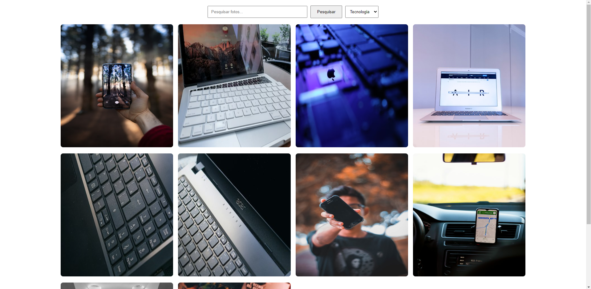
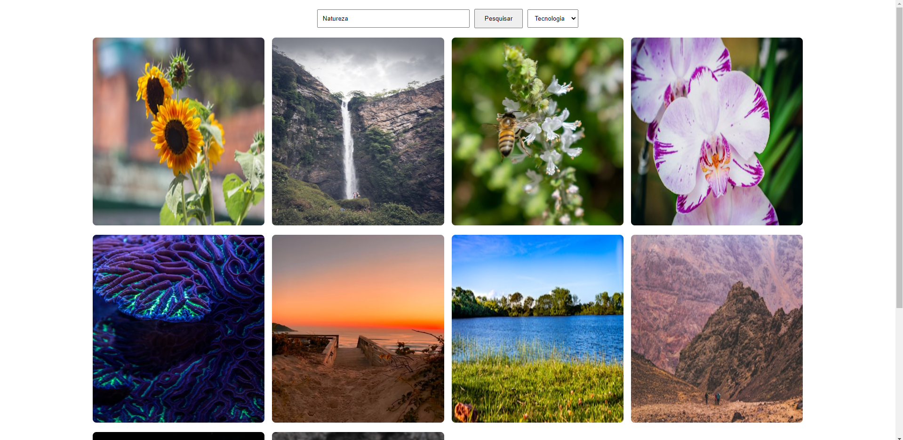

# Álbum de Fotos

## Descrição

Projeto de Álbum de Fotos desenvolvido em React, JavaScript, HTML e CSS. A página principal inclui um recurso de busca com input e botão, além de um seletor de categorias para filtrar fotos.

## Funcionalidades Principais

* Busca Rápida:

    * Input de busca para encontrar fotos com base em palavras-chave.
    * Botão "Pesquisar" para iniciar a busca.

* Categorias Dinâmicas:

    * Seletor que permite mudar a categoria e exibir fotos relacionadas.

* Requisições em Tempo Real:

    * Utiliza requisições de API para atualizar instantaneamente a página com os resultados da busca ou da mudança de categoria.

## Tecnologias

* React, JavaScript, HTML, CSS, Fetch API:
    * Desenvolvimento eficiente e interativo da interface do usuário.

## Como Utilizar

1. Digite palavras-chave na barra de busca.
2. Clique em "Pesquisar" para obter resultados.
3. Escolha uma categoria no seletor para filtrar as fotos.

## Imagens

